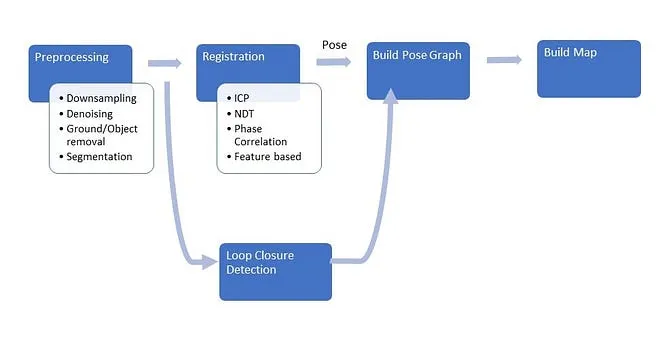
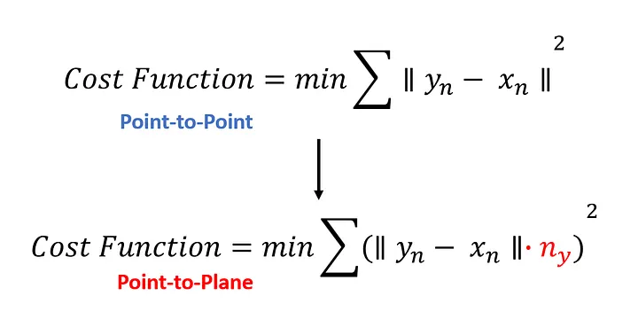
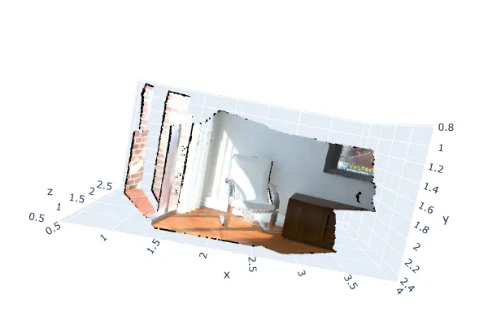
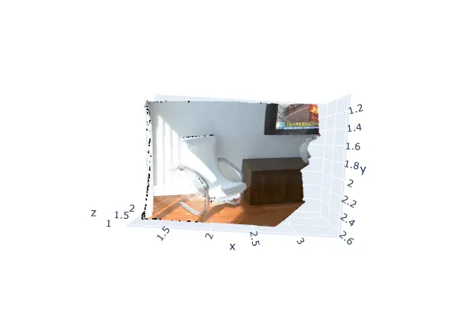
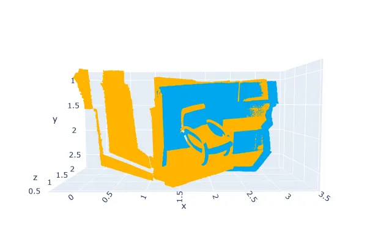
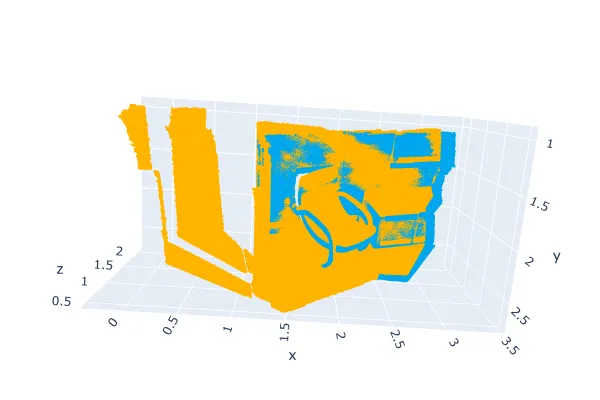
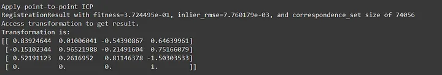
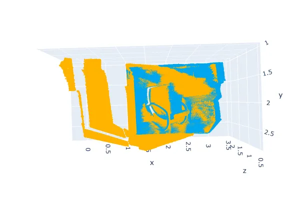

# Point Cloud Registration Tutorial

A Tutorial for Point Cloud Registration.

## Resources
- 2004
  - [Multiple View Geometry in Computer Vision — Richard Hartley & Andrew Zisserman](https://www.r-5.org/files/books/computers/algo-list/image-processing/vision/Richard_Hartley_Andrew_Zisserman-Multiple_View_Geometry_in_Computer_Vision-EN.pdf)
- 2016
  - [Review: Fast Point Feature Histograms (FPFH) For 3D Registration](https://ciis.lcsr.jhu.edu/lib/exe/fetch.php?media=courses:446:2016:446-2016-06:dadler_fpfh_review_final.pdf) 
- 2019
  - [The Extension of Phase Correlation to Image Perspective Distortions Based on Particle Swarm Optimization](https://pmc.ncbi.nlm.nih.gov/articles/PMC6679575/#:~:text=Phase%20Correlation%20is%20an%20image%20matching%20algorithm%20based%20on%20the,Fourier%20frequency%20domain%20%5B6%5D.)
- 2021
  - [Point-to-Plane and Generalized ICP - 5 Minutes with Cyrill](https://youtu.be/2hC9IG6MFD0?si=o5HmEQYFyt-2Gb2x)
- 2023
  - [Gentle Introduction to Point Cloud Registration Using Open3d Blog](https://medium.com/@amnahhmohammed/gentle-introduction-to-point-cloud-registration-using-open3d-c8503527f421)
  - [Gentle Introduction to Point Cloud Registration using Open3D Video](https://www.youtube.com/watch?v=3pjCWuTLLrQ)

## Introduction

In this article, we will be:

- Looking at what registration is and it’s different type
- Learn about Global vs. Local Registration
- Look at the different types of Iterative Closest Point Methods
- Work with Iterative Closest Point for Point-to-point and Point-to-plane

## The Importance of Point Cloud Registration

Now that we took a look at some of the different preprocessing techniques, let’s look at the next step in the general workflow which is registration.

<div align="center">
  
  <p><i>General Workflow of Processing Point Clouds to Build Maps.</i></p>
</div>

When a lidar scanner moves along the room, it takes different points a different intervals. So how can we use these point clouds to build a map of the environment and to figure out the relative motion between them?

We can do so with registering point clouds through different approaches such as:

* Iterative Closest Point (ICP):
Iterative Closest Point algorithm keeps one point cloud, which is the reference, fixed, while transforming (usually a combination of translation and rotation) the other, the source, to best match the reference.

* Normal distributions transform (NDT):
NDT registers two point clouds by first associating a piecewise normal distribution to the first point cloud, that gives the probability of sampling a point belonging to the cloud at a given spatial coordinate, and then finding a transform that maps the second point cloud to the first by maximising the likelihood of the second point cloud on such distribution as a function of the transform parameters.

* Phase Correlation:
Phase Correlation is an image matching algorithm based on the Fourier shift property, which states that a translation shift between two similar images generates a linear phase difference in the Fourier frequency domain

* Feature-based:
In this method, stochastic or functional models try to use point, line, plane or other features as a way to estimate 3D spatial similarity transformation parameters.

In this article however, we will be looking at ICP Registration.

As mentioned above, during ICP registration, one of the two point clouds is kept as reference (source) while transforming the other (target) to roughly align the source point cloud to the target point cloud. The output is a refined transformation that tightly aligns the two point clouds.

There are two ICP variants: the point-to-point ICP, and the point-to-plane ICP.

## Point-to-Point ICP vs. Point-to-Plane ICP
Point to Point ICP and Point to Plane ICP are similar in concept. The main change is in the cost function. Unlike point to point ICP, where we are looking for the closest point in the other point cloud for all of those points and then trying to minimize the square distances between them, in Point-to-Plan ICP, we additionally take the normal information into account.

We do so through computing surface normals on my target point cloud and then project the error vector and take the dot product with the euclidean distance between the points on the source and target point clouds.

<div align="center">
  
</div>

As shown in the figure above, the only modification to the cost function is the addition of the dot product of the normal of target point in the PCD denoted as n_y, where y_n is the target point in in the target PCD, and x is the source point in the source PCD.

Let’s get to Coding!
First things first, let’s import the source and target point clouds that we will be working with.
```
import import numpy as np
import open3d as o3d
import copy

#Read Source and Target PCD
demo_pcds = o3d.data.DemoICPPointClouds()
source = o3d.io.read_point_cloud(demo_icp_pcds.paths[0])
target = o3d.io.read_point_cloud(demo_icp_pcds.paths[1])
```
When visualising both point clouds we can see them as follows:

<div align="center">
  
  
  <p><i>Right: Source Left:Target</i></p>
</div>

It’s obvious that both the source and target are point clouds of the same environment but at different angles.

Rather than using the visualisation function we are familiar with, let’s use Open3D’s helper function draw_registration_result.It visualizes the alignment during the registration process.
```
def draw_registration_result(source, target, transformation):
    source_temp = copy.deepcopy(source)
    target_temp = copy.deepcopy(target)
    source_temp.paint_uniform_color([1, 0.706, 0])
    target_temp.paint_uniform_color([0, 0.651, 0.929])
    source_temp.transform(transformation)
    o3d.visualization.draw_geometries([source_temp, target_temp],
                                      zoom=0.4459,
                                      front=[0.9288, -0.2951, -0.2242],
                                      lookat=[1.6784, 2.0612, 1.4451],
                                      up=[-0.3402, -0.9189, -0.1996])
```
In this tutorial, we show two ICP variants, the point-to-point ICP and the point-to-plane ICP [Rusinkiewicz2001].
The function requires the source, and target point clouds as arguments. To align them on top of each other, we must also specify an inital transformation to align the point clouds on top of each.

The function above visualizes a target point cloud with yellow and a source point cloud twith cyan ransformed with an alignment transformation. The more they overlap, the better.

To get a rough image of these point cloud’s alignment, let’s specify a temperoray transformation that is obtained using a global registration algorithm.

```
trans_init = np.asarray([[0.862, 0.011, -0.507, 0.5],
                         [-0.139, 0.967, -0.215, 0.7],
                         [0.487, 0.255, 0.835, -1.4], [0.0, 0.0, 0.0, 1.0]])
draw_registration_result(source, target, trans_init)
```

## Global and Local Registration
During the registration between the point clouds, common algorithms such as Iterative Closest Point (ICP), do not converge to the global error minimum and instead converge to a local minimum, hence ICP registration is referred to as a local registration. It relies on an approximate alignment as an initial step.

Another category of registration methods is global registration. These algorithms do not depend on alignment for initialization. Typically, they produce less precise alignment outcomes but make aid in converging to the global minimum and hence are employed as the initial step for local methods.

## Evaluating Point Cloud Registration Before Applying Iterative Closest Point
With the transformation that we’ve initialised and obtained from a global registration method, we can calculate how efficient the results of global registration alone can be through the use of the function evaluate_registration. It calculates two main metrics:

fitness: which measures the overlapping area (# of inlier correspondences / # of points in target). The higher the better.
inlier_rmse: which measures the Root Mean Square Error of all inlier correspondences. The lower value the better the registration results are.
```
print("Initial alignment")
evaluation = o3d.pipelines.registration.evaluate_registration(
    source, target, threshold, trans_init)
print(evaluation)
```
The code above calls the evaluate_registration method from the registration pipeline and takes in the source point cloud, target point cloud, threshold, and initial transformation. When evaluating the transformation of the global registration, through the evaluate_registration method we obtain the below results:

<div align="center">
  
</div>

We get a fitness score of 0.1747228, and inlier RMSE of 0.01771. To increase the fitness score and finetune the registration process, let’s go ahead and use a local registration method known as “Iterative Closest Point”.

<div align="center">
  
  <p><i>Point Cloud Registration through Global Registration.</i></p>
</div>

## Applying Iterative Closest Point-to-Point
```
threshold=0.02
print("Apply point-to-point ICP")
reg_p2p = o3d.pipelines.registration.registration_icp(
    source, target, threshold, trans_init,
    o3d.pipelines.registration.TransformationEstimationPointToPoint())
print(reg_p2p)
print("Transformation is:")
print(reg_p2p.transformation)
draw_registration_result(source, target, reg_p2p.transformation)
```
Here we apply the registration_icp method of the registration pipeline. This requires the below as arguments:

* Source Point Cloud
* Target Point Cloud
* Threshold also known as max_correspondence_distance which is the maximum correspondence points-pair distance, here we specify it as 0.02.
* Initial global registration: this is optional, so if unlike this example and we don’t have a global registration transformation we can not specify it and the is: array([[1., 0., 0., 0.], [0., 1., 0., 0.], [0., 0., 1., 0.], [0., 0., 0., 1.]]). In this example, we already do have an initialisation from a global registration called “trans_init”.
* Method of registration: Either one of the two methods below:
  * Registration Point to Point: `registration::TransformationEstimationPointToPoint`
  * Registration Point to Plane: `registration::TransformationEstimationPointToPlane`
The default is PointToPoint without scaling. In this example we specified that we would like to use point-to-point.

## Evaluating Point Cloud Registration After Applying Iterative Closest Point
The above returns “open3d.registration.RegistrationResult” which displays the fitness and RMSE score resulting from the ICP. We also displayed the result in the draw_registration_result as below:

<div align="center">
  
  <p><i>Point Cloud Registration with ICP.</i></p>
</div>

Point Cloud Registration with ICP

<div align="center">
  
</div>

We get a musch better fitness score of 0.3724495, and lower inlier RMSE of 0.007760179.

## Applying Iterative Closest Point-to-Plane
```
threshold=0.02
print("Apply point-to-point ICP")
reg_p2p = o3d.pipelines.registration.registration_icp(
    source, target, threshold, trans_init,
    o3d.pipelines.registration.TransformationEstimationPointToPlane())
print(reg_p2p)
print("Transformation is:")
print(reg_p2p.transformation)
draw_registration_result(source, target, reg_p2p.transformation)
```
When working with point-to-plane, we do the same thing but rather than specifying `registration::TransformationEstimationPointToPoint` we use registration::TransformationEstimationPointToPlane.

We get an even better fitness and RMSE result using point-to-plane as observed below:

Press enter or click to view image in full size

Fitness score of 0.6209722 and inlier RMSE of 0.006581453! Much better results than using global registration alone, and with ICP point-to-point!

<div align="center">
  
  <p><i>Registration with ICP Point-to-Plane.</i></p>
</div>


## Conclusion
This tutorial provided a concise overview of point cloud registration, focusing on the Iterative Closest Point (ICP) method. It explained the iterative optimization process of aligning a source point cloud to a target point cloud and introduced coding examples using the Open3D library. 

